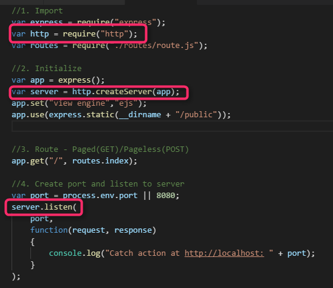
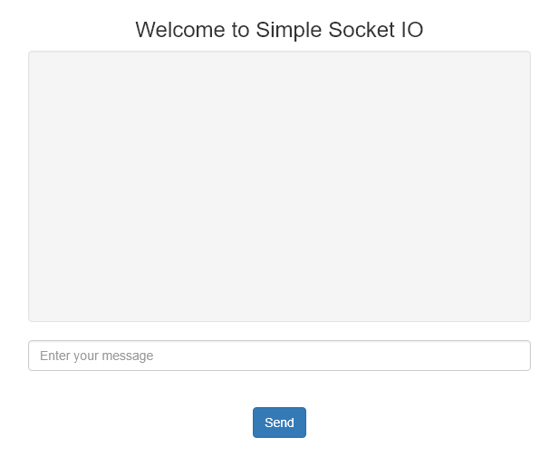

This is basic premise or infrastructure to start socket.io
It is doing nothing yet except functionally

Note the way, the server is made this time..A server object is created upfront, because that is also next needed to be used by socket.io module

 

Output is a simple html infrastructure..

 

References:
https://socket.io/get-started/chat/

https://www.youtube.com/watch?v=tHbCkikFfDE

https://www.youtube.com/watch?v=8Y6mWhcdSUM

