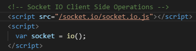

Update: 20th Oct 2017 10:50 AM  
Phase 0 Step 2: Simple socket created.  

Server: 
  
  

Client: 
  

Demo:  
New page => new socket connected  
Close page => disconnect socket  
  

Page refresh: socket disconnected and created  
  
